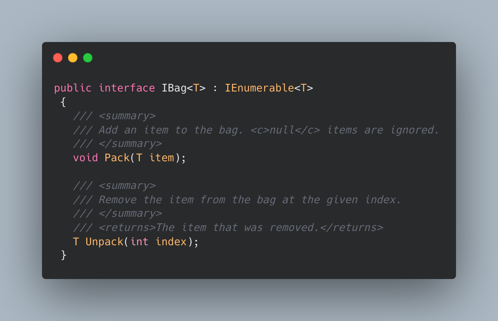

# Lab 08: Phil’s Lending Library

## The Problem Domain

> Use TDD to create your own `Lending Library`, filled with `Books`, and a `Backpack` to hold borrowed `Books`.

---

## Specifications

1. Create a `Book` class to hold appropriate properties (e.g. Title, Author)
2. Copy this interface into your project, then create a `Library` class that implements it:
    
    - Since books need to be borrowed by Title, use a private `Dictionary<string, Book>` for storage.
3. Copy this interface into your project, then create a generic `Backpack<T>` class that implements it to hold anything (like borrowed Books!):
    
    - Since items need to be unpacked by index, use a `private List<T>` for storage.

---

### Unit Tests

*Test that your program has the following functionality:*

1. Add a `Book` to your Library
2. Borrowing an existing title returns the `Book` and removes it
    - Hint: `Assert.DoesNotContain(book, library)`
    - Hint: `Count` should decrease
3. Borrowing a missing title returns `null`
4. A returned `Book` is once again in the Library
    - Hint: `Assert.Contains(book, library)`
    - Hint: `Count` should increase
5. Pack and Unpack your `Backpack`
    - Hint: `Backpack` can store anything so it may be easier to test with `string` or `int` instead of `Book`

---
